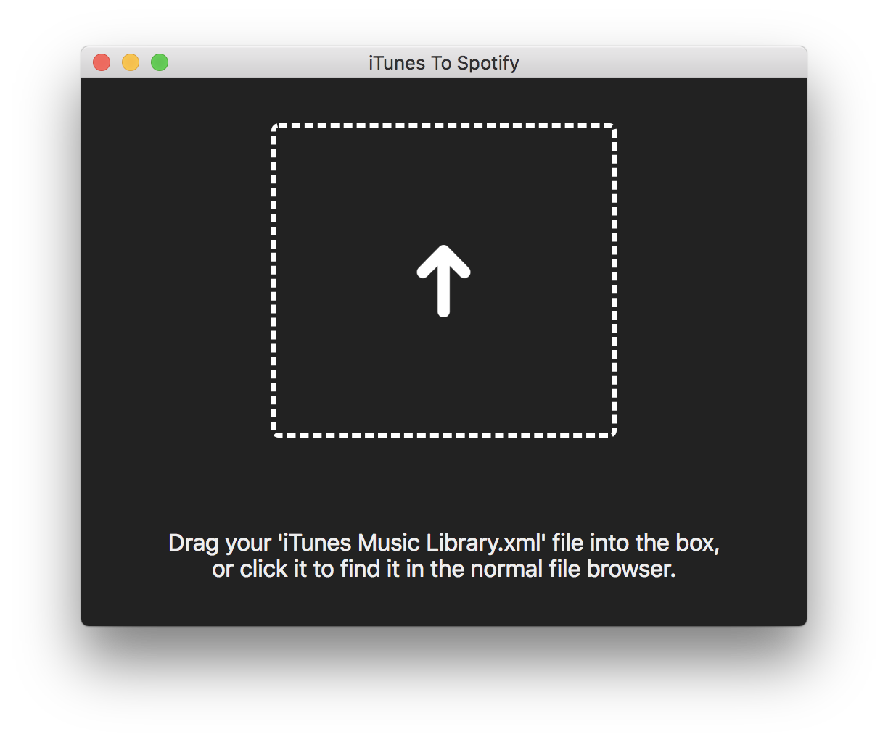
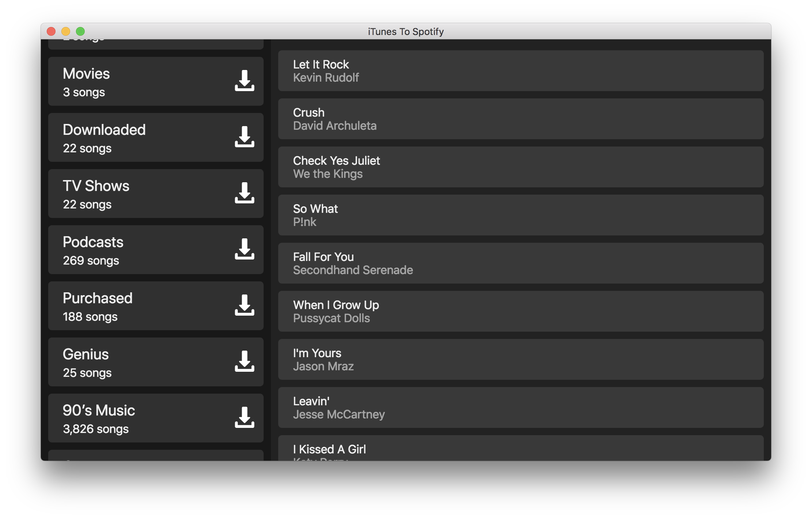
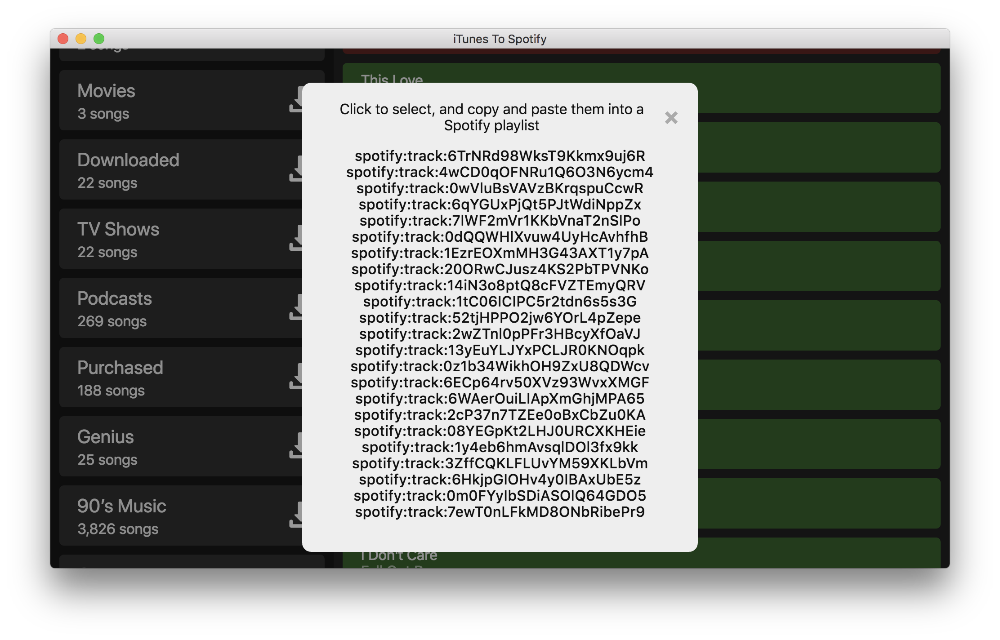

# iTunes To Spotify 

iTunes to Spotify is an Electron application that helps to convert iTunes playlists to Spotify playlists.  It takes in an `iTunes Music Library.xml` file, and tries to match them to Spotify tracks, which you can easily copy and paste into a Spotify playlist.

## Instructions

To convert your playlist, just follow these easy steps.

1. Create an iTunes Library XML file by following the [instructions here](https://osxdaily.com/2018/05/23/itunes-library-xml-file-missing-fix/).

  

2. Drag the XML file to the upload box, or click the box to choose it from your computer.

  

3. Click any playlist on the left to see the tracks in it loaded on the right.  Clicking the 'Download' button will start the download process for all tracks in it.

  

4. When all tracks have been processed (green for found, red for failed), it will popup this window with all of the track IDs.  Just click and copy with 'Command + C', and then paste them into an empty Spotify playlist.

### Run Locally
- Run `npm install` to build the node_modules folder.
- Create a `secret.js` file in the `js` folder, of the form `export { CLIENT_ID = '...', CLIENT_SECRET = '...' }` where `CLIENT_ID` and `CLIENT_SECRET` are the keys for your Spotify application created in the [Spotify developer interface](https://developer.spotify.com).
- To run locally, use `npm start`.
- To build for distribution, use `npm run dist`.  You will need to modify the bundle ID info to your own.

### Download
You can download the .dmg file from the repo [here](https://github.com/dado3212/iTunesToSpotify/blob/master/dist/iTunesToSpotify-1.0.0.dmg?raw=true).

<ul>
  <li>
  Electron
  <ul>
  <li>
  JS
  <ul>
  <li>Node</li>
  <li>jQuery</li>
  </ul>
  </li>
  <li>
  HTML
  </li>
  <li>
  CSS
  </li>
  </ul>
  </li>
</ul>

### Thanks To
- [electron-quick-start](https://github.com/electron/electron-quick-start)
- Dean Murphy for Sketch recreation of the iTunes gradient: http://murphyapps.co/blog/2015/7/1/recreating-the-new-itunes-app-icon

**Created by Alex Beals © 2018**
